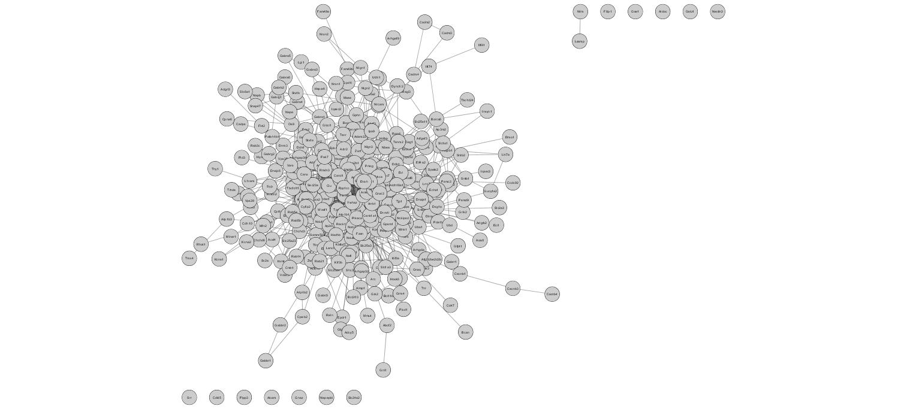

# getPPIs



An R package that facilitates the compilation of experimentally identified and 
confidence-scored protein-protein interactions (PPIs) from the 
[HitPredict](http://hintdb.hgc.jp/htp/) database.

#### HitPredict:
> Protein-protein interactions from IntAct, BioGRID, HPRD, MINT and DIP are 
> combined, annotated and scored. The reliability score is calculated based 
> on the experimental details of each interaction and the sequence, structure and 
> functional annotations of the interacting proteins.

For more information about HitPredict, please see authors' original publications:
* Lopez _et al.,_ [Database 2015](https://www.ncbi.nlm.nih.gov/pmc/articles/PMC4691340/)
* Patil _et al.,_ [Nucleic Acids Res. 2011](https://www.ncbi.nlm.nih.gov/pubmed/20947562)
* Patil and Nakamura [BMC Bioinformatics 2005](https://www.ncbi.nlm.nih.gov/pubmed/15833142)

## Installation
In R, download the package from GitHub:

```R
devtools::install_github("twesleyb/getPPIs")
```
## Dependencies
* data.table
* dplyr
* igraph
* xml2
* rvest
* tools
* AnnotationDbi
* ontologyIndex
* BiocManager

#### Installation of annotation databases.
`installDBs` automates the installation of several gene ID mapping databases.

## Usage
The package contains several key functions:
1. __getHitPredict__ - facilitates download of HitPredict data and mapping protein identifiers to stable Entrez gene IDs.
2. __getHomoloGene__ - maps genes to homologs in a species of interest.
3. __getMethods__ - annotates the HitPredict detection methods with more human-readable names.
4. __getPPIs__ - wrapper function that does the work getHitPredict, getHomoloGene, and getPPIs.
5. __buildNetwork__ - builds a PPI graph given some genes of interest (currently only works for mouse).

#### Example
```
library(getPPIs)

# 1. Download HitPredict database.
hitpredict <- getHitPredict("HitPredict")

# 2. Map genes to homologous mouse genes.
hitpredict <- getHomoloGene(hitpredict, taxid=10090)

# 3. Annotate hitpredict data with method names.
hitpredict <- getMethods(hitpredict)

# 4. Equivalently, steps 1-3 are performed by `getPPIs`:
getPPIs("HitPredict", taxid = 10090)

# 5. Build a PPI graph:
g <- buildNetwork(ppis, taxid=10090)

```

## Additional Datasets
The package contains several other useful datasets.

#### Mouse interactome
PPIs among mouse proteins were compiled. Download the data 
[here](https://github.com/twesleyb/getPPIs/blob/master/data/musInteractome.zip).
Or load the data in R with `data(musInteractome)`. See this [script](./example.R)
for a usage example.

#### Proteomics datasets
The package contains several published proteomics datasets. To access them, use the
`data()` function:

```
library(getPPIs)

data(Wrp)           # Wrp-BioID from Spence et al., 2019.
data(iPSD)          # iPSD data from Uezu et al., 2016.
data(compiled_iPSD) # A iPSD proteome compiled from several studies.
data(ePSD)          # PSD-96-BioID data from Uezu et al., 2016.
```
